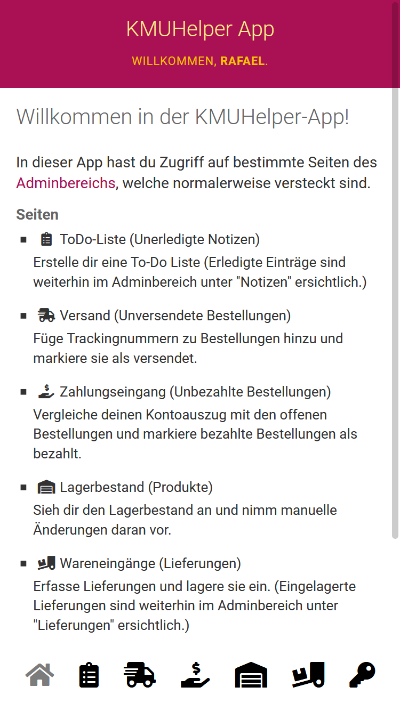

# App

Der KMUHelper kommt mit seiner eigenen kleinen (Web-)App.
Diese befindet sich unter `/kmuhelper/app/`.

Wenn Sie diese Seite auf dem Handy öffnen, können Sie, je nach Ihrem Betreibssystem, die Webseite zum Home-Bildschirm hinzufügen. (Googlen Sie dazu nach Ihrem Betreibssystem + `PWA installieren`, falls Sie noch nicht wissen, wie und ob das geht. -> z.B. ["iOs PWA installieren"](https://www.google.com/search?q=iOs+PWA+installieren) oder ["Android PWA installieren"](https://www.google.com/search?q=Android+PWA+installieren))

Die App sollte nach dem Login so aussehen:

## Funktionen

Diese App beinhaltet versteckte Seiten des Django-Adminbereichs, welche die einfachere Massenverwaltung von Bestellungen, Lagerbestand, Notizen und Lieferungen ermöglichen.

Die einzelnen Seiten sind auf der Startseite beschrieben.

## Zurück

[Zurück zum Handbuch](./)
