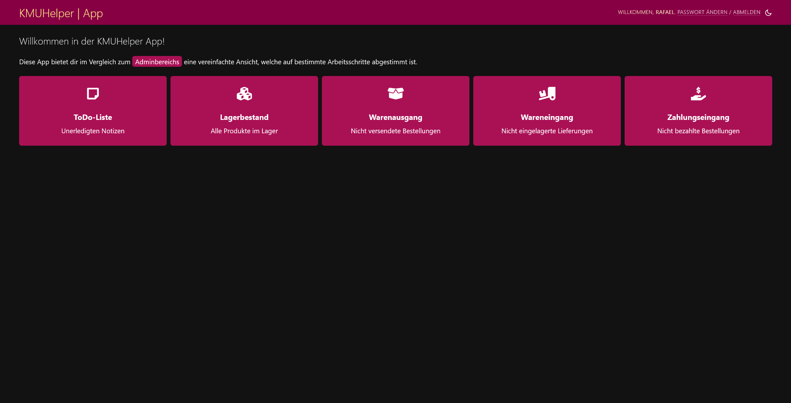

# App

_Der KMUHelper kann auf diversen Geräten als App installiert werden. Manche Browser fordern direkt dazu auf, bei anderen
muss auf "Zum Home-Bildschirm hinzufügen", "Zum Dock hinzufügen" o.ä. geklickt werden._

Unter KMUHelper "App" wird jedoch etwas anderes verstanden: Dies sind Admin-Seiten, welche auf einen bestimmten
Arbeitsschritt zugeschnitten und optimiert wurden.

## App

Die App kann über die KMUHelper-Startseite aufgerufen werden.

## Funktionen

Diese App beinhaltet Seiten, welche die einfachere Massenverwaltung von Bestellungen, Lagerbestand, Notizen und
Lieferungen ermöglichen. Manche Funktionen sind gegenüber der normalen Admin-Seiten jedoch eingeschränkt, um die App
nicht zu überladen. Daher befindet sich auf jeder Seite einen Link, welcher auf die entsprechende Admin-Seite verweist.

## Zurück

[Zurück zum Handbuch](./README.md)
