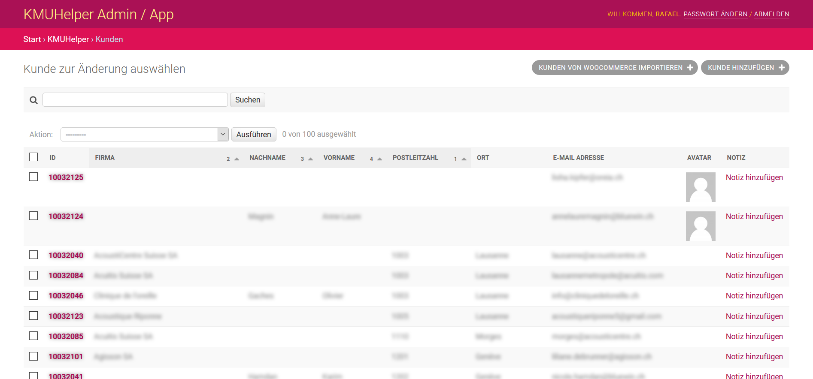

# Kundenmanagement

In diesem Tutorial wird erklärt, wie Sie Ihre Kunden verwalten können.

Das Kundenmanagement befindet sich unter `/admin/kmuhelper/customer/`. (via Adminbereich erreichbar)

Dort sehen Sie als erstes eine Auflistung aller bereits erfassten Kunden.
Um einen neuen Kunden hinzuzufügen, klicken Sie oben rechts auf `Kunde hinzufügen`. Je nach Konfiguration können Sie
auch Kunden von anderen Orten importieren.

## Kunde

Bei jedem Kunden können Sie folgende Felder festlegen:

- Vorname, Nachname und Firmenname
- E-Mail-Adresse und Benutzername haben aktuell noch keine Funktion, werden aber von WooCommerce importiert.
- Sprache (Wird vorerst nur für den Rechnungsdruck verwendet, nicht aber für E-Mails)
- Rechnungsadresse und Lieferadresse
    - Sie können mit dem entsprechenden Knopf die Lieferadresse automatisch von der Rechnungsadresse übernehmen.
    - **Hinweis**: Die Lieferadresse wird nur im Lieferschein verwendet, welcher zusätzlich zur Rechnung gedruckt werden
      kann.

<!-- List seperator -->

- Webseite und Bemerkung haben aktuell keine Funktion und dienen nur zu eigenen Zwecken.

- Notiz - Hier können Sie eine Notiz erstellen, welche automatisch mit diesem Kunden verknüpft wird.

Im Anschluss sehen Sie eine Ansicht des Kundenmanagements:

## Funktionen

Kunden dienen hauptsächlich als Speicherort von Daten für das schnelle Erstellen von neuen Bestellungen und um
Bestellungsverläufe für Kunden anzusehen.

Beim Erstellen von Bestellungen kann ein Kunde ausgewählt werden, aus welchem die Adressen _kopiert_ werden. (Diese sind
dann unabhängig vom Kunden gespeichert.)

## Zurück

[Zurück zum Handbuch](./README.md)
