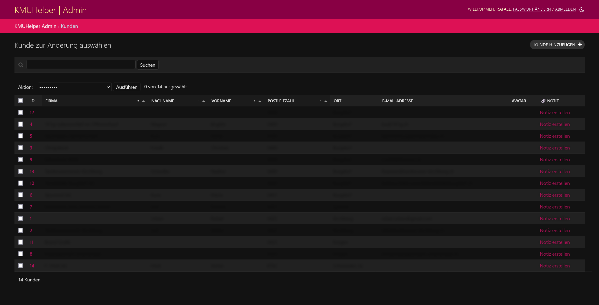

# Kundenmanagement

In diesem Tutorial wird erklärt, wie Sie Ihre Kunden verwalten können.

Das Kundenmanagement befindet sich unter `/admin/kmuhelper/kunde/`.

Dort sehen Sie als erstes eine Auflistung aller bereits erfassten Kunden.
Um einen neuen Kunden hinzuzufügen, klicken Sie oben rechts auf `Kunde hinzufügen`. Je nach Konfiguration können Sie auch Kunden von anderen Orten importieren.

## Kunde

Bei jedem Kunden können Sie folgende Felder festlegen:

- Vorname, Nachname und Firmenname
- E-Mail-Adresse und Benutzername haben aktuell noch keine Funktion, werden aber von WooCommerce importiert.
- Sprache (Wird vorerst nur für den Rechnungsdruck verwendet.)
- Rechnungsadresse und Lieferadresse
  - Oben rechts finden Sie einen Knopf, mit welchem Sie die Rechnungsadresse automatisch zur Lieferadresse kopieren können. (Dies geschieht lokal,    solange Sie also nicht speichern, passiert nichts.)
  - Hinweis: Die Lieferadresse wird nur im Lieferschein verwendet, welcher zusätzlich zur Rechnung gedruckt werden kann!
- Webseite und Bemerkung haben aktuell keine Funktion und dienen nur zu eigenen Zwecken.

- Notiz (nur in der Listenansicht) - Hiermit können Sie eine Notiz erstellen, welche automatisch mit diesem Kunden verknüpft wird.

Im Anschluss sehen Sie eine Ansicht des Kundenmanagements

## Zurück

[Zurück zum Handbuch](./README.md)
