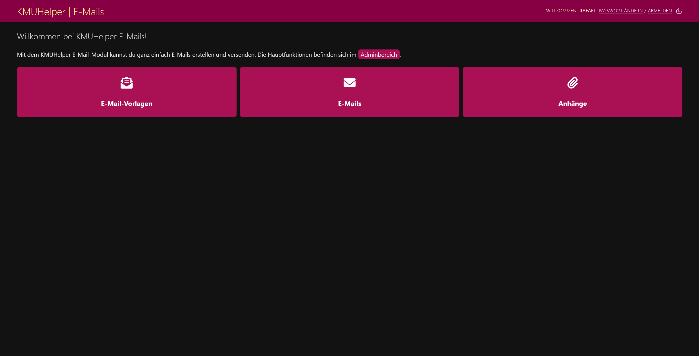

# E-Mails

Mit dem KMUHelper können auch E-Mails versendet werden.

## Dashboard

Das E-Mail Dashboard kann über den Startbildschirm erreicht werden. Es besteht aus drei Seiten:

- E-Mail
- Anhänge
- E-Mail Vorlagen

### E-Mail

E-Mails besitzen folgende Einstellungsmöglichkeiten, welche wie bei normalen E-Mails funktionieren:

- Betreff
- Empfänger (Je eine E-Mail pro Zeile)
    - Direkte(r) Empfänger
    - CC (Kopie)
    - BCC (Blindkopie)
- Anhänge

Zusätzlich können festgelegt werden:

- Designvorlage
    - Sollte in den meisten Fällen nicht verändert werden.
    - Es handelt sich dabei um in `kmuhelper/emails/` gespeicherte HTML-Dateien.
- Text
    - Der Hauptinhalt der E-Mail.
    - Je nach Designvorlage wird dieser nicht zwingend verwendet.
    - Unterstützt KEIN HTML
    - Links und E-Mail-Adressen werden in Links verwandelt.
- Daten
    - Zusätzliche Daten, mit welchen die Designvorlage befüllt wird.
    - In den meisten Fällen überflüssig.
    - Müssen im JSON-Format angegeben werden.
    - Die Vorlage `base.html` (und somit `default.html`) unterstützt folgende Einstellungen:
        - `header_title`: Der Text im Header
        - `header_background`: Die Hintergrundfarbe des Headers (HEX, z. B. `#FFFFFF`)
        - `header_foreground`: Die Vordergrundfarbde des Headers (HEX, z. B. `#000000`)
        - `precontent`: Inhalt vor dem Hauptinhalt (gleiche Funktionen wie Text)
        - `postconent`: Inhalt nach dem Hauptinhalt (gleiche Funktionen wie Text)
          &dash;&gt; Überschreibt Signatur!

### Anhänge

Anhänge können manuell hochgeladen und an eine E-Mail angehängt werden. Diese können auch beliebig gelöscht werden,
sofern sie nicht an einer E-Mail angehängt sind. Um diese trotzdem zu löschen, müsste zuerst die E-Mail gelöscht werden,
dies würde aber "online ansehen" Links unbrauchbar machen.

### E-Mail Vorlagen

E-Mail-Vorlagen betreffen nur den Text einer E-Mail. Diese sind jedoch nicht mit den in Dateien gespeicherten
Designvorlagen zu verwechseln! Mit E-Mail Vorlagen können zum Beispiel häufig verwendete Texte einfach kopiert und
angepasst werden. Diese Vorlagen unterstützen sogar eine Platzhalter-Fähigkeit. Diese ist auf der Erstellungsseite für
Vorlagen erklärt.

**Hinweis**: Die Vorlagen werden mit der E-Mail NICHT verknüpft, diese werden nur zum Generieren einer E-Mail verwendet.

## Online ansehen

E-Mails werden, sofern in den [Einstellungen](#einstellungen-fortgeschritten) aktiviert, mit einem "online ansehen" Link
versendet. Personen, welche einen veralteten E-Mail Client verwenden, können die E-Mail somit im Browser ansehen.

**ACHTUNG**: Wenn ein E-Mail im KMUHelper gelöscht wird, wird dieser Link ungültig!

## Automatisch generierte E-Mails

Eine E-Mail mit der Rechnung oder dem Lieferschein zu einer Bestellung kann per Knopfdruck automatisch generiert werden.
Dazu erscheint, sofern E-Mail Knöpfe in den Admin-Einstellungen aktiviert sind und benötigte Berechtigungen vorhanden
sind, in der oberen rechten Ecke ein Knopf. E-Mails werden jedoch nicht direkt versendet und können zuerst angesehen und
ggf. angepasst werden. Die Vorlage dazu (`kmuhelper/emails/bestellung_rechnung.html`) muss möglicherweise je nach
Verwendungszweck überschrieben werden. (fortgeschritten)

## Automatisierte E-Mails

Wenn in den [Einstellungen](#einstellungen) eine E-Mail-Adresse für Warnungen zum Lagerbestand angegeben wurde, wird
beim Import von Bestellungen automatisch geprüft, ob diese Bestellung den Lagerbestand mancher Produkte gefährdet.
Sollte dies der Fall sein, wird automatisch eine E-Mail versendet, in welcher ersichtlich ist, von welchen Produkten
noch wie viel vorhanden sind. Dies wird übrigens auch beim Speichern einer Bestellung sowie eines Produktes geprüft,
jedoch wird in diesem Fall keine E-Mail versendet.

Alle automatisch gesendeten E-Mails werden auch in der E-Mail-Ansicht aufgeführt.

## Einstellungen

In den Einstellungen, welche via Adminbereich erreicht werden können, befinden sich folgende Optionen:

1. E-Mail Knöpfe anzeigen: Zeige oder verstecke E-Mail Knöpfe bei Bestellungen und Kunden
2. E-Mail für Warnungen zum Lagerbestand: E-Mail Adresse für automatische Lagerbestandswarnungen
3. E-Mail Signatur: Hiermit kann eine Signatur gespeichert werden, welche allen E-Mails nach dem Hauptinhalt angehängt
   wird. (Kann per E-Mail via `postcontent` überschrieben werden.)

## Einstellungen (fortgeschritten)

Bei den fortgeschrittenen Einstellungen handelt es sich um die Einstellungsdatei `settings.py`. Für all diese
Einstellungen befindet sich in
der [Einstellungsdatei der Vorlage](https://github.com/rafaelurben/djangoproject-template-kmuhelper-heroku/blob/master/mysite/settings.py#L244-L259)
ein Beispiel.

1. Um zu jeder E-Mail einen "online ansehen" Link hinzuzufügen, muss die Einstellung `KMUHELPER_DOMAIN` gesetzt sein. (
   z.B. `https://office.example.com`)
2. Mit `KMUHELPER_LOG_EMAIL` kann eine E-Mail Adresse festgelegt werden, welche zu allen ausgehenden E-Mails als BCC
   hinzugefügt wird.
3. Ausserdem können mit `KMUHELPER_EMAILS_DEFAULT_CONTEXT` die Standarddaten für E-Mails festgelegt werden. Diese werden
   bei allen E-Mails verwendet, sofern nicht via "Daten" überschrieben. (Hinweis: `postcontent` wird von der Signatur
   überschrieben, sofern vorhanden!)

## Zurück

[Zurück zum Handbuch](./README.md)
