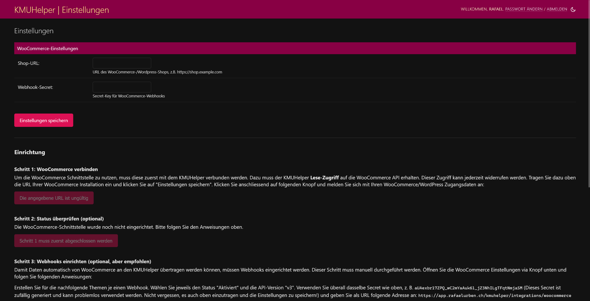

# WooCommerce-Integration

Sie können den KMUHelper mit einem WooCommerce Shop verbinden, um Bestellungen, Produkte und Kunden von WooCommerce zu
importieren.

Klicken Sie dazu in den KMUHelper-Einstellungen auf `Zu den WooCommerce-Einstellungen` und folgen Sie den Anweisungen.
Sie werden Schritt für Schritt durch eine Anleitung geführt.

Die Integration mit WooCommerce ist einseitig. Das heisst, dass die Daten aus WooCommerce in den KMUHelper importiert
werden, aber nicht umgekehrt. Wenn Sie also z.B. eine Bestellung im KMUHelper erstellen, wird diese nicht in WooCommerce
übernommen. (WICHTIG: Manche Daten im KMUHelper werden bei Erhalt der Daten von WooCommerce ÜBERSCHRIEBEN! Deshalb
sollten Sie Änderungen an Produkten und Kunden vorzugsweise in WooCommerce vornehmen und nicht im KMUHelper, um Fehler
zu vermeiden.)

Damit die Daten im KMUHelper auch automatisch importiert und aktualisiert werden, können sogenannte "Webhooks"
eingerichtet werden, welche bei jeder Änderung in WooCommerce den KMUHelper darüber informieren. Dies ist nicht
zwingend notwendig, aber stark empfohlen.

**Hinweis**: Beim Löschen eines Objektes in WooCommerce wird dieses im KMUHelper nicht automatisch gelöscht! Es wird
lediglich als gelöscht markiert und in der Standardansicht verborgen.

## Verwendung

Im KMUHelper-Admin finden Sie bei Produkten, Produktkategorien, Bestellungen und Kunden einen `Importieren` Knopf,
mit welchem die Daten der gewünschten Kategorie manuell aus WooCommerce geladen werden können.

### Probleme

Je nach Menge von Daten kann der Importprozess von Objekten sehr lange dauern. Je nach Hosting-Provider könnte die
Verbindung nach 30 Sekunden abgebrochen werden (Dies ist z.B. bei Heroku der Fall!). In diesem Fall ist ein (mehrfaches)
Neuladen der Seite hilfreich.

Das Neuladen ist jedoch nicht hilfreich bei manuellem Aktualisieren von einer grösseren Menge von Objekten! In diesem
Fall müssen die Objekte in mehrere Teile aufgeteilt werden.

## Zurück

[Zurück zur Einrichtung](../setup.md#integrationen) - [Zurück zum Handbuch](../README.md#inhalt)
