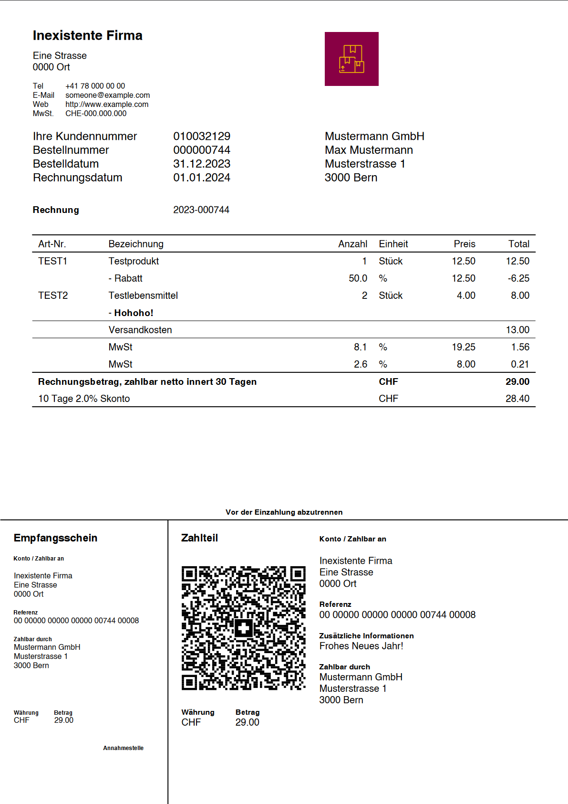

# Bestellung & Rechnung

Mit dem KMUHelper können Sie Bestellungen erfassen und die dazugehörige Rechnung sowie einen Lieferschein drucken. Die
Rechnung besteht aus einer Liste von Produktposten sowie allfällige Kosten und die Mehrwersteuer. Dazu kommt natürlich
die Adresse des Kunden und ein paar Informationen über die Rechnung und den Zahlungsempfänger und selbstverständlich die
QR-Rechnung. Im Lieferschein werden die Rechnung, Kosten und Preise weggelassen.

Beispielrechnung: (Anklicken, um als PDF herunterzuladen)

*****

## Bestellung erstellen

Als erstes müssen Sie die Erstellseite für Bestellungen (`/admin/kmuhelper/order/add`) öffnen. Diese ist via
Admin-Bereich -> Bestellungen -> Hinzufügen erreichbar.

Dort können Sie als erstes den Zahlungsempfänger und Ansprechpartner der Bestellung auswählen.
Anschliessend können Sie Einstellungen zur Lieferung und Bezahlung vornehmen.

Als nächstes können Sie einen Kunden auswählen. Klicken Sie dazu in das Feld und wählen Sie einen Kunden aus oder
beginnen Sie zu tippen, um die Kunden zu durchsuchen. Wenn ein Kunde ausgewählt wird, werden beim ersten Speichern
automatisch die Adressen des Kunden in die Bestellung kopiert. Falls Sie keinen Kunden auswählen, können Sie nach dem
ersten Speichern die Adressen manuell eingeben.

Das Feld "Kundennotiz" dient dazu, Kundenwünsche zu notieren. (Bei Import von WooCommerce ist dieses Feld nicht
bearbeitbar.)

Weiter unten können Sie Bestellungsposten (Produkte) sowie Bestellungskosten (Gebühren/Kosten) hinzufügen.

Wenn Sie alle Daten ausgefüllt haben, können Sie unten oder oben auf der Seite auf `Sichern und weiter bearbeiten`
klicken.

Nach dem ersten Speichern sehen Sie neue, zuvor nicht ersichtliche Optionen. Dies beinhaltet zum Beispiel das Datum und
der Status der Bestellung sowie Rechnungsadresse und Lieferadresse der Bestellung. Auch sehen Sie nun berechnete Summen
und die Optionen, die Bestellung als `versendet` und `bezahlt` zu markieren.

**Hinweis**: Die Summen werden immer nur beim Speichern aktualisiert!

**Hinweis**: Das Feld `Status` hat keine Funktion und dient nur zu Übersichtszwecken.

Sehen Sie auch
["Was passiert, wenn ich eine Bestellung als bezahlt/versendet markiere?"](faq.md#was-passiert-wenn-ich-eine-bestellung-als-bezahltversendet-markiere)

## PDF generieren

Nachdem Sie alles gespeichert haben sind sie bereit, eine Rechnung zu drucken. Dazu können Sie oben rechts auf der Seite
im Dropdown `PDF generieren` auf `Rechnung` => `Druck` klicken und das PDF-Dokument ausdrucken.

Beachten Sie dabei, dass **per Papier versendete** QR-Rechnungen auf ein perforiertes Papier gedruckt werden **müssen**
und dass Sie möglicherweise die **Druckgrösse auf 100%** einstellen müssen, falls dies nicht Standard ist. Passen Sie
bei mehrseitigen Rechnungen auch auf, dass Sie nur die letzte Seite auf perforiertes Papier drucken und dass deren
Rückseite leer bleiben muss!

Oben rechts können Sie auch eine digitale Rechnung, einen Lieferschein oder ein benutzerdefiniertes PDF erstellen.

## E-Mails

Sofern in den Einstellungen aktiviert, befindet sich oben rechts auf der Seite auch ein Dropdown Menu für E-Mails. Dort
kann automatisch eine E-Mail mit dem PDF als Anhang generiert werden.

## Zurück

[Zurück zum Handbuch](./README.md)
