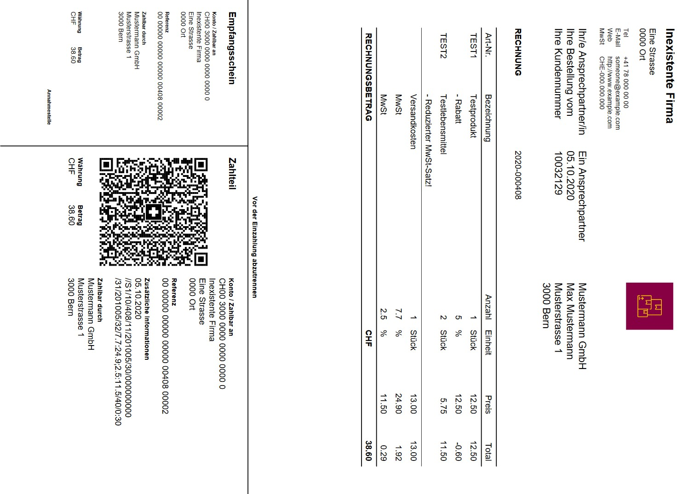

# Bestellung & Rechnung

Mit dem KMUHelper können Sie Bestellungen erfassen und die dazugehörige Rechnung sowie einen Lieferschein drucken. Die Rechnung besteht aus einer Liste von Produktposten sowie allfällige Kosten und die Mehrwersteuer. Dazu kommt natürlich die Adresse des Kunden und ein paar Informationen über die Rechnung und den Zahlungsempfänger (Firma) und selbstverständlich die QR-Rechnung. Im Lieferschein werden die Rechnung, Kosten und Preise weggelassen.

Beispielrechnung: (Hinweis: Das Logo kann geändert werden!)

*****

Als erstes müssen Sie die Erstellseite für Bestellungen (`/admin/kmuhelper/bestellung/add`) öffnen. Diese ist via Admin-Bereich (`/admin/kmuhelper`) -> Bestellungen -> Hinzufügen erreichbar.

Dort können Sie als erstes den Zahlungsempfänger und Ansprechpartner der Bestellung auswählen.
Anschliessend können Sie Einstellungen zur Lieferung und Bezahlung vornehmen.

Als nächstes können Sie einen Kunden auswählen. Klicken Sie dazu auf die Lupe neben dem Feld und wählen Sie einen Kunden aus oder geben Sie direkt die Kundennummer ein, falls Sie diese wissen. Wenn ein Kunde ausgewählt wird, werden beim ersten Speichern automatisch die Adressen des Kunden in die Bestellung kopiert. Falls Sie keinen Kunden auswählen, können Sie nach dem ersten Speichern die Adressen manuell eingeben. (Die zweite Variante ist jedoch nicht empfohlen!)

Das Feld "Kundennotiz" dient dazu, Kundenwünsche zu notieren. (Bei Import von WooCommerce ist dieses Feld nicht bearbeitbar.)

Weiter unten können Sie Bestellungsposten sowie Bestellungskosten hinzufügen. Auch dort können Sie wieder mit der Lupe arbeiten. **Bitte beachten Sie jedoch, dass die ID des Produkts, welche in dieses Feld gehört, NICHT zwingend der Artikelnummer entspricht!**

Wenn Sie alle Daten ausgefüllt haben, können Sie unten oder oben auf der Seite auf `Sichern und weiter bearbeiten` klicken.

Nach dem ersten Speichern sehen Sie neue, zuvor nicht ersichtliche Optionen. Dies beinhaltet zum Beispiel das Datum und der Status der Bestellung sowie Rechnungsadresse und Lieferadresse der Bestellung. Auch sehen Sie nun berechnete Summen und die Optionen, die Bestellung als `versendet` und `bezahlt` zu markieren. Bitte beachten Sie, dass die Summen immer nur beim Speichern aktualisiert werden!

Sobald eine Bestellung als bezahlt markiert wurde, können Bestellungsposten, Bestellungskosten, Rechnungsadresse sowie Zahlungsmethode nicht mehr bearbeitet werden!

Sobald eine Bestellung als versendet markiert wurde, können Bestellungsposten, Lieferadresse sowie Trackingnummer nicht mehr bearbeitet werden!

*****

Nachdem Sie alles gespeichert haben sind sie bereit, eine Rechnung zu drucken. Dazu können Sie oben rechts auf der Seite auf `Rechnung (Druck)` klicken und das PDF-Dokument ausdrucken. **Beachten Sie dabei, dass Sie möglicherweise die Druckgrösse auf 100% einstellen müssen, falls dies nicht Standard ist.**

Oben rechts können Sie auch eine digitale Rechnung sowie einen Lieferschein abrufen.

## Zurück

[Zurück zum Handbuch](./README.md)
