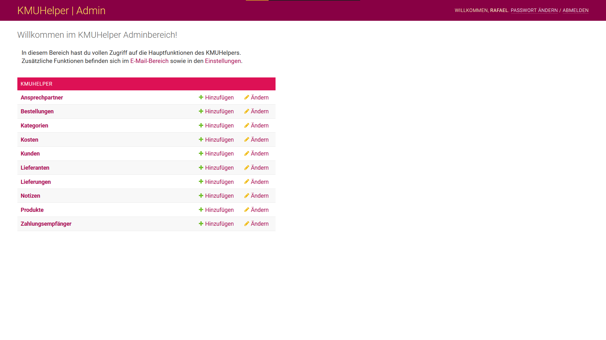

# Einrichtung

Rufen Sie als erstes folgende Seite auf: `/admin/kmuhelper/`

Sie sollten folgende Ansicht erhalten:

Falls dies nicht der Fall ist, stimmt irgendetwas nicht und Sie sollten überprüfen, ob die Installation korrekt ausgeführt wurde.

## Zahlungsempfänger

Klicken Sie im Adminbereich auf `Zahlungsempfänger` und danach auf `Zahlungsempfänger hinzufügen` oder direkt neben `Zahlungsempfänger` auf `hinzufügen`.

Füllen Sie alle Felder realitätsgetreu aus und klicken Sie auf `Sichern`

## Ansprechpartner

Jeder Bestellung wird ein Ansprechpartner zugeordnet. Da Bestellungen zwingend einen Ansprechpartner brauchen, muss mindestens ein Ansprechpartner vorhanden sein, damit man eine Bestellung erstellen kann.

Klicken Sie im Adminbereich auf `Ansprechpartner` und danach auf `Ansprechpartner hinzufügen` oder direkt neben `Ansprechpartner` auf `hinzufügen`.

Füllen Sie alle Felder realitätsgetreu aus und klicken Sie auf `Sichern`

Sie können so viele Ansprechpartner erstellen, wie Sie wollen. Die Informationen eines Ansprechpartners werden auf der Rechnung jeder Bestellung mit diesem Ansprechpartner ersichtlich sein.

## Integrationen

Falls Sie eine Wordpress-Seite mit WooCommerce haben, können Sie diese [mit dem KMUHelper verbinden](apis/woocommerce).

## Fertig

Die grundlegende Einrichtung ist nun abgeschlossen.

Bevor Sie bereit sind, Rechnungen zu erstellen, müssen Sie jedoch zuerst noch Produkte und Kunden hinzufügen. Sie finden Anleitungen dazu auf der [Startseite](./) des Benutzerhandbuches.
