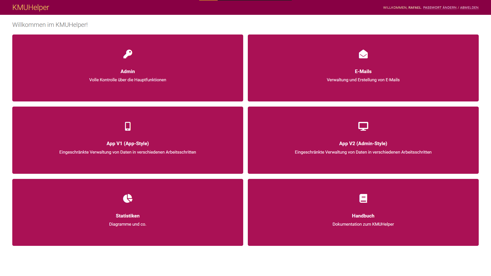

# Einrichtung

Rufen Sie als erstes folgende Seite auf: `/kmuhelper/`

Sie sollten folgende Ansicht erhalten:

Wenn Sie dann auf Admin klicken, sollten Sie auf folgende Seite gelangen:

Falls dies nicht der Fall ist, stimmt irgendetwas nicht und Sie sollten überprüfen, ob die Installation korrekt ausgeführt wurde.

## Zahlungsempfänger

Klicken Sie im Adminbereich auf `Zahlungsempfänger` und danach auf `Zahlungsempfänger hinzufügen` oder direkt neben `Zahlungsempfänger` auf `hinzufügen`.

Füllen Sie alle Felder realitätsgetreu aus und klicken Sie auf `Sichern`.

Dies ist notwendig, da mindestens ein Zahlungsempfänger vorhanden sein muss, um Bestellungen erstellen zu können.

Zu beachten gilt hierbei, dass der KMUHelper zurzeit nur QR-IBANs unterstützt. (Diese starten nach der Prüfziffer immer mit einer 3, also `CHpp 3xxx xxxx xxxx xxxx x`)

PS: Leider können im KMUHelper direkt keine Bilder hochgeladen werden, deshalb muss auf ein extern gespeichertes Bild verwiesen werden.

## Ansprechpartner

Jeder Bestellung wird ein Ansprechpartner zugeordnet, welcher auf auf Rechnungen ersichtlich ist. Da Bestellungen zwingend einen Ansprechpartner brauchen, muss mindestens ein Ansprechpartner vorhanden sein, damit eine Bestellung erstellt werden kann.

Klicken Sie im Adminbereich auf `Ansprechpartner` und danach auf `Ansprechpartner hinzufügen` oder direkt neben `Ansprechpartner` auf `hinzufügen`.

Füllen Sie alle Felder realitätsgetreu aus und klicken Sie auf `Sichern`.

Sie können so viele Ansprechpartner erstellen, wie Sie wollen.

## Einstellungen

Von `/admin/kmuhelper` können Sie mit einem Klick auf `Einstellungen` ein paar Einstellungen vornehmen, diese können aber auch zu einem späteren Zeitpunkt angepasst werden.

## Integrationen

Falls Sie eine Wordpress-Seite mit WooCommerce haben, können Sie diese [mit dem KMUHelper verbinden](apis/woocommerce.md).

## Fertig

Die grundlegende Einrichtung ist nun abgeschlossen.

Bevor Sie bereit sind, Rechnungen zu erstellen, müssen Sie jedoch zuerst noch Produkte und Kunden hinzufügen. Sie finden Anleitungen dazu auf der [Startseite](./README.md) des Benutzerhandbuches.
