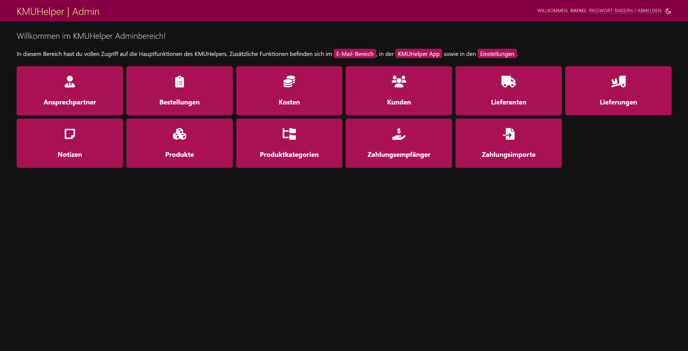

# Einrichtung

Rufe als erstes folgende Seite auf: `/admin/kmuhelper/`

Du solltest folgende Ansicht erhalten:

Falls dies nicht der Fall ist, stimmt irgendetwas nicht und du solltest überprüfen, ob die Installation korrekt ausgeführt wurde.

## Zahlungsempfänger

Klicke im Adminbereich auf `Zahlungsempfänger` und danach auf `Zahlungsempfänger hinzufügen` oder direkt neben `Zahlungsempfänger` auf `hinzufügen`.

Fülle alle Felder realitätsgetreu aus und klicke auf `Sichern`

## Ansprechpartner

Jeder Bestellung wird ein Ansprechpartner zugeordnet. Da Bestellungen zwingend einen Ansprechpartner brauchen, muss mindestens ein Ansprechpartner vorhanden sein, damit man eine Bestellung erstellen kann.

Klicke im Adminbereich auf `Ansprechpartner` und danach auf `Ansprechpartner hinzufügen` oder direkt neben `Ansprechpartner` auf `hinzufügen`.

Fülle alle Felder realitätsgetreu aus und klicke auf `Sichern`

Du kannst so viele Ansprechpartner erstellen, wie du willst. Die Informationen eines Ansprechpartners werden auf der Rechnung jeder Bestellung mit diesem Ansprechpartner ersichtlich sein.

## Integrationen

Falls du eine Wordpress-Seite mit WooCommerce hast, kannst du diese [mit dem KMUHelper verbinden](apis/woocommerce).

## Fertig

Die grundlegende Einrichtung ist nun abgeschlossen.

Bevor du bereit bist, Rechnungen zu erstellen, musst du jedoch zuerst noch Produkte und Kunden hinzufügen. Du findest Anleitungen dazu auf der [Startseite](./) des Benutzerhandbuches.
