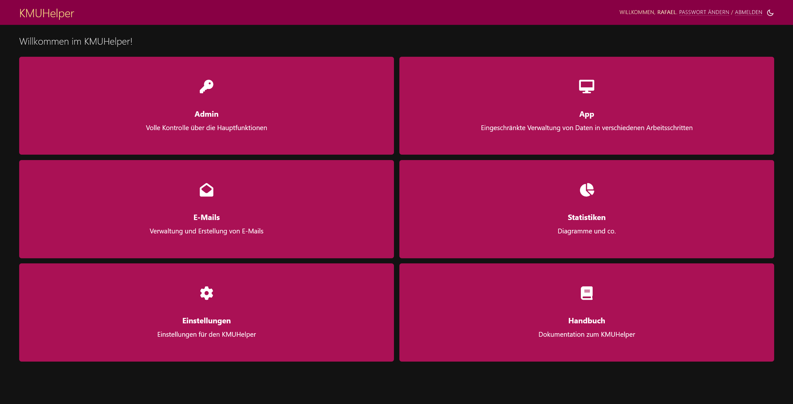

# Einrichtung

Rufen Sie als erstes folgende Seite auf: `/kmuhelper/`

Sie sollten folgende Ansicht erhalten:

Wenn Sie dann auf Admin klicken, sollten Sie auf folgende Seite gelangen:

Falls dies nicht der Fall ist, stimmt irgendetwas nicht und Sie sollten überprüfen, ob die Installation korrekt
ausgeführt wurde.

## Zahlungsempfänger

Klicken Sie im Adminbereich auf `Zahlungsempfänger` und danach auf `Zahlungsempfänger hinzufügen`.
Füllen Sie alle Felder realitätsgetreu aus und klicken Sie auf `Sichern`.

Unterstützt werden sowohl normale IBAN als auch QR-IBAN. Für die Darstellung auf Rechnungen stehen verschiedene
Anzeigemodi zur Auswahl: "Geschäftlich (Bestellungen)", "Geschäftlich (Dienstleistungen)", "Verein" und "Privat". Je
nach Modus werden auf der Rechnung andere Felder angezeigt.

Es kann auch ein Logo festgelegt werden, welches auf die Rechnungen gedruckt wird. (_Leider können im KMUHelper direkt
keine Bilder hochgeladen werden, deshalb muss auf ein extern gespeichertes Bild verwiesen werden._)

**Hinweis**: Ohne Zahlungsempfänger können keine Bestellungen erstellt werden!

## Ansprechpartner

Jeder Bestellung wird ein Ansprechpartner zugeordnet, welcher ebenfalls auf Rechnungen ersichtlich ist.

Klicken Sie im Adminbereich auf `Ansprechpartner` und danach auf `Ansprechpartner hinzufügen`. Füllen Sie alle Felder
realitätsgetreu aus und klicken Sie auf `Sichern`.

**Hinweis**: Ohne Ansprechpartner können keine Bestellungen erstellt werden!

## Einstellungen

Klicken Sie auf der Startseite auf `Einstellungen`, gelangen Sie auf eine Seite, auf welcher diverse Einstellungen
im KMUHelper vorgenommen werden können.

## Integrationen

Falls Sie eine Wordpress-Seite mit WooCommerce besitzen, können
Sie [WooCommerce dem KMUHelper verbinden](integrations/woocommerce.md).

## Fertig

Die grundlegende Einrichtung ist nun abgeschlossen.

Bevor Sie bereit sind, Rechnungen zu erstellen, müssen Sie jedoch zuerst noch Produkte und Kunden hinzufügen. Sie finden
Anleitungen dazu auf der [Startseite](./README.md) des Benutzerhandbuches.
