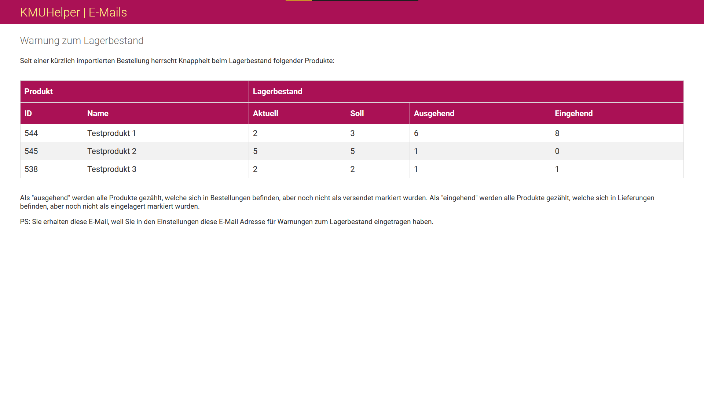

# Lagermanagement

Der KMUHelper besitzt ein integriertes Lagermanagement, leider können jedoch nicht mehrere Lager erfasst werden.

Bei jedem Produkt gibt es das Feld "Lagerbestand". Dieses wird bei folgenden Ereignissen aktualisiert:

- Manuelle Änderung
- Lieferung als "eingelagert" markieren
- Bestellung als "versendet" markieren

Wenn eine Bestellung gespeichert wird, werde alle Produktposten dieser Bestellung mit allen offenen Bestellungen und dem
aktuellen Lagerbestand verglichen. Falls der vorhergesehene Lagerbestand den "Soll-Lagerbestand" (kann bei jedem Produkt
separat geändert werden; Standard: 1) unterschreitet, wird eine dementsprechende Warnung angezeigt. Falls dies beim
Import einer Bestellung passiert, wird eine E-Mail an den in den Einstellungen festgelegten Empfänger gesendet.

Eine solche E-Mail Warnung sieht ungefähr so aus:

## Inventar

Wenn Sie Ihren Lagerbestand in den KMUHelper übertragen möchten, geht dies am Besten auf der Seite "Lagerbestand" in
der [KMUHelper App](app.md).

## Zurück

[Zurück zum Handbuch](./README.md)
